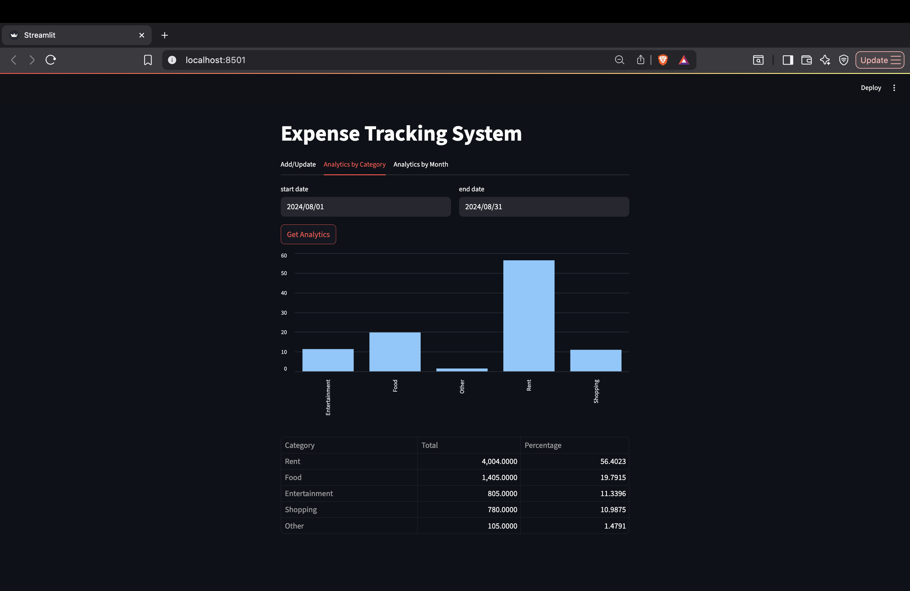

# Expense Tracking System

This project is an expense management system that consists of a **Streamlit** frontend application and a **FastAPI** backend server.

## Project Structure

- **frontend/**: Contains the Streamlit application code.  
- **backend/**: Contains the FastAPI backend server code.  
- **tests/**: Contains the test cases for both frontend and backend.  
- **requirements.txt**: Lists the required Python packages.  
- **README.md**: Provides an overview and setup instructions for the project.

## Frontend UI Previews

Below are screenshots of the main tabs in the Streamlit application:

###  Add / Update Tab

<p align="center">
  
</p>

### Analytics by Category Tab

<p align="center">
  
</p>

###  Analytics by Month Tab

<p align="center">
  
</p>

## Setup Instructions

1. **Clone the repository**:
   ```bash
   git clone https://github.com/adithyavarma05/Expense-Tracking-System.git
   cd Expense-Tracking-System
   ```
1. **Install dependencies:**:   
   ```commandline
    pip install -r requirements.txt
   ```
1. **Run the FastAPI server:**:   
   ```commandline
    uvicorn server.server:app --reload
   ```
1. **Run the Streamlit app:**:   
   ```commandline
    streamlit run Frontend/app.py